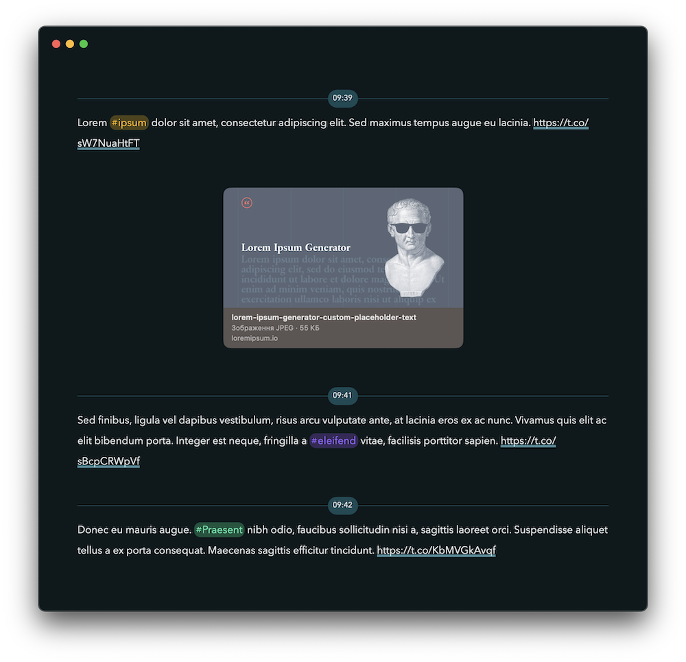

# twitter2diarly

Copy tweets from Twitter (X) to the Diarly app.

This script converts the Twitter archive to a CSV file for
importing into the Diarly app.



# Features

- Group tweets by date.

- Adds native Diarly time separator.

- Add links to videos and photos (your profile should be public).

- Skips retweets and tweets starting with mention
(may be disabled, read further instructions).

# Requirements

Ruby 2.7.7 or higher is required to run this script.

The code is tested on macOS with `ruby-2.7.7 [ arm64 ]`.

# Steps to follow

## 1. Download an archive from Twitter

Skip these steps if you have already downloaded the archive of your tweets.

1. Open Twitter, select "Settings", "Your account", and
"Download an archive of your data".

2. Press "Download archive".
Verify identity with email or text message.

3. Press "Request archive".
Twitter with email you when the archive will be ready.

4. When the archive is ready, press "Download archive".

## 2. Convert the archive

1. Unzip the archive and move its content to the `archive` folder inside of
this project, so you will have the following structure:

```
archive
  assets
  data
    tweets.js
  Your archive.html
convert.rb
README.md
```

2. Run the script with `ruby convert.rb`.

3. If everything is correct, the `result.csv` file will be generated and
you will see the success message in the console.

## 3. Import to Diarly

1. Open Diarly app, and select "File", "Import", and "CSV".
Select the generated `result.csv` file in this project folder.

9. Click "Import". If you don't see all tweets imported in the app
after a few seconds, restart the Diarly app.

# Configuration

You can adjust the configuration by changing the "true" and "false" values
inside the `config.json` file:

- `with_mentions`: false = ignore tweets with "@" in the text.

- `with_mentions_at_start`: false = ignore tweets starting with "@"
(ignored if `with_mentions` is false).

- `retweets`: false = ignore retweets.

- `with_media`: false = ignore tweets that have media.

- `keep_media`: false = keep the text of tweets, but omit videos and photos
(ignored if `with_media` is false).
